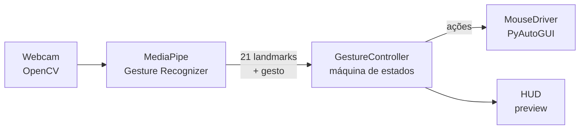

<div align="center">

# Mouse Hand

**Controle o mouse do seu computador só com a mão, usando a webcam.**

Visão computacional em tempo real com MediaPipe + OpenCV: mova o cursor, clique, arraste e role a página sem tocar no mouse.

[](https://github.com/joaopldantas/mouse_cv/actions/workflows/ci.yml)


[](LICENSE)


<!-- TODO: grave um GIF curto (5–10s) mostrando os gestos e salve em docs/demo.gif -->
<!--  -->

</div>

---

## Funcionalidades

- **Cursor suave** — o indicador controla o ponteiro, com suavização exponencial para eliminar tremidas.
- **Clique, clique direito e arrastar** com gestos de pinça (polegar + indicador).
- **Scroll** com a mão aberta, subindo ou descendo.
- **Reconhecimento de gestos** pelo modelo de *Gesture Recognizer* do MediaPipe (ex.: punho fechado → clique direito).
- **HUD ao vivo** na janela da câmera: modo atual, gesto detectado, dedos levantados e última ação.
- **Seguro por padrão** — solta o botão do mouse ao perder a mão ou ao sair, e mantém o *fail-safe* do PyAutoGUI como parada de emergência.
- **Lógica de gestos testável** — a máquina de estados é Python puro, coberta por testes que rodam sem webcam.

## Gestos

| Ação | Gesto |
| --- | --- |
| **Mover cursor** | Mova o dedo indicador dentro do retângulo central da câmera |
| **Clique esquerdo** | Pinça rápida (encoste e solte polegar + indicador) |
| **Clique direito** | Duas pinças rápidas seguidas **ou** punho fechado |
| **Arrastar / soltar** | Segure a pinça por ~0,5s para agarrar; abra os dedos para soltar |
| **Scroll** | 4 dedos estendidos; leve a mão para o topo (sobe) ou para baixo (desce) da imagem |
| **Sair** | Tecla `q` na janela de preview (ou `Ctrl+C`) |

> O retângulo cinza no preview é a área mapeada para a tela inteira — assim você alcança as bordas sem tirar a mão do enquadramento.

## Começando

### Requisitos

- Python 3.9+
- Uma webcam
- **macOS:** conceda ao Terminal/IDE permissão de *Câmera* e *Acessibilidade* em Ajustes do Sistema → Privacidade e Segurança.

### Instalação

```bash
git clone https://github.com/joaopldantas/mouse_cv.git
cd mouse_cv
python -m venv .venv
source .venv/bin/activate      # Windows: .venv\Scripts\activate
pip install -e .
```

### Uso

```bash
mouse-cv
```

Ou, sem instalar o comando: `python -m mouse_cv`.

| Opção | Descrição |
| --- | --- |
| `-c, --camera N` | Índice da câmera (padrão `0`) |
| `-m, --model PATH` | Caminho para outro modelo `.task` |
| `--no-preview` | Roda sem a janela da câmera |
| `-v, --verbose` | Logs detalhados |

## Como funciona



1. Cada frame é espelhado e enviado ao **Gesture Recognizer** do MediaPipe em modo `LIVE_STREAM` (assíncrono).
2. O resultado (21 pontos da mão + gesto classificado) vira uma `HandObservation`.
3. O **`GestureController`** decide o que fazer — sem efeitos colaterais, ele só retorna ações (`MoveTo`, `Click`, `MouseDown`, `MouseUp`, `Scroll`).
4. O **`MouseDriver`** executa essas ações no sistema operacional via PyAutoGUI.

Alguns detalhes que deixam a interação estável:

- **Histerese na pinça:** a pinça começa abaixo de uma distância e só termina acima de outra, maior — evita “piscar” no limiar.
- **Clique adiado:** um clique simples espera a janela de duplo-clique terminar antes de disparar, para que duas pinças virem clique direito sem gerar um clique esquerdo antes.
- **Debounce e cooldowns** por ação para ignorar ruído de detecção.

## Configuração

Todos os parâmetros ficam em [`src/mouse_cv/config.py`](src/mouse_cv/config.py), documentados. Os mais úteis:

| Parâmetro | Padrão | Efeito |
| --- | --- | --- |
| `cursor_smoothing` | `0.25` | Menor = mais suave porém mais lento |
| `move_x_min/max`, `move_y_min/max` | `0.15`–`0.85` | Área da câmera mapeada para a tela |
| `pinch_start_dist` / `pinch_end_dist` | `0.055` / `0.075` | Sensibilidade da pinça |
| `drag_hold_time` | `0.45s` | Tempo segurando a pinça para iniciar o arraste |
| `double_click_gap` | `0.5s` | Janela para a segunda pinça (clique direito) |
| `scroll_step` | `90` | Intensidade de cada passo de scroll |

## Estrutura do projeto

```
mouse_cv/
├── src/mouse_cv/
│   ├── app.py          # loop da câmera, MediaPipe e CLI
│   ├── controller.py   # máquina de estados dos gestos (pura, testável)
│   ├── config.py       # parâmetros ajustáveis
│   ├── geometry.py     # helpers de landmarks (distância, dedos levantados…)
│   ├── hud.py          # overlay desenhado no preview
│   ├── mouse.py        # adaptador PyAutoGUI
│   └── models/
│       └── gesture_recognizer.task
├── tests/              # testes da lógica de gestos (sem webcam)
└── pyproject.toml
```

## Desenvolvimento

```bash
pip install -e ".[dev]"
pytest          # testes
ruff check .    # lint
ruff format .   # formatação
```

O CI roda lint e testes em Python 3.9 e 3.12 a cada push e pull request.

## Solução de problemas

| Problema | Solução |
| --- | --- |
| `Could not open camera 0` | Verifique a permissão de câmera ou tente `--camera 1`. |
| O cursor não se move (macOS) | Dê permissão de **Acessibilidade** ao app que roda o Python (Terminal, iTerm, VS Code…). |
| `FailSafeException` | Você levou o mouse físico a um canto da tela — é a parada de emergência do PyAutoGUI. É só rodar de novo. |
| Cursor tremendo | Diminua `cursor_smoothing` e melhore a iluminação. |
| Cliques acidentais | Diminua `pinch_start_dist`. |

## Roadmap

- [ ] Configuração por arquivo (TOML) e via CLI, sem editar código
- [ ] Calibração automática da área de movimento
- [ ] Suporte a duas mãos (ex.: zoom com pinça dupla)
- [ ] Gestos personalizados treinados com MediaPipe Model Maker

## Créditos

- [MediaPipe Gesture Recognizer](https://ai.google.dev/edge/mediapipe/solutions/vision/gesture_recognizer) — modelo de detecção de mãos e gestos (Apache 2.0)
- [OpenCV](https://opencv.org/) e [PyAutoGUI](https://github.com/asweigart/pyautogui)

## Licença

Distribuído sob a licença MIT. Veja [`LICENSE`](LICENSE) para mais detalhes.
